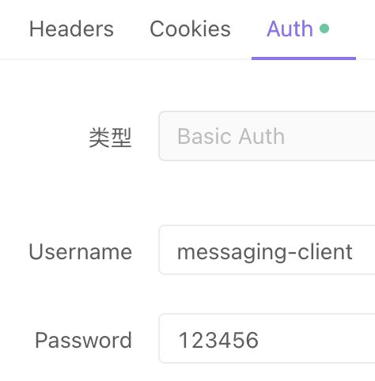

# 
 Central Authentication Service

  
  
  

## 介绍

Central Authentication Service (CAS 中央认证服务 OAuth2.1协议)

> 正在开发...

基于[Spring Authorization Server](https://spring.io/projects/spring-authorization-server)
开发,在源码基础上新增了额外功能,比如修改令牌的展示值为UUID,踢人下线（只签发一个可用的令牌）等.
目前1.0.1版本官方没有Redis储存授权信息的功能，根据业务需要自定义了Redis储存授权信息功能.

## 使用说明

### 1. 新建数据库

新建的数据库名称为`cas`

### 2. 新建表

使用`docs/sql/CAS_DDL.sql`的文件建表

| 表名                                 | 描述            |
|------------------------------------|---------------|
| t_cas_client                       | CAS 客户端       |
| t_cas_client_authentication_method | CAS 客户端身份验证方法 |
| t_cas_client_grant_type            | CAS 客户端授权类型   |
| t_cas_client_redirect_url          | CAS 客户端重定向地址  |
| t_cas_client_scope                 | CAS 客户端作用域    |
| t_cas_client_scope_permission      | CAS 作用域权限关系   |
| t_cas_client_setting               | CAS 客户端设置     |
| t_cas_client_token_setting         | CAS 客户端令牌设置   |
| t_cas_client_user                  | CAS 客户端用户     |
| t_cas_client_user_role             | CAS 客户端用户角色关系 |
| t_cas_permission                   | CAS 权限        |
| t_cas_role                         | CAS 角色        |
| t_cas_role_permission              | CAS 角色权限关系    |
| t_cas_user                         | CAS 用户        |

### 3. 添加测试数据的两种方法

**建议使用第一种（单元测试）**
> 用户名：user 密码：password
>
> 客户端id：test-client 密码：123456

1. 运行单元测试  
   初始化测试数据单元测试：  
   `com.maoatao.cas.CasApplicationTests#initialize_test_data()`
2. 使用SQL导入  
   使用`docs/sql/CAS_DML_DEMO.sql`的文件导入数据

### 4. 生成授权码的两种方法

1. OAuth2提供的
   1. 接口地址：http://127.0.0.1:18080/oauth2/authorize
   2. 方法：GET
   3. 权限：Spring Security 用户登录后同意授权（如果需要同意）
   4. 示例：`http://127.0.0.1:18080/oauth2/authorize?response_type=code&client_id=test-client&scope=test.read%20test.write&redirect_uri=https://cn.bing.com&code_challenge_method=S256&code_challenge=3vrxycun-VbyenvO5GiFOaOBazUBX_xcFElnqbl-TXA`
2. 我自定义的
    1. 接口地址：http://127.0.0.1:18080/authorization
    2. 方法：POST **(application/json)**
    3. 权限：无
    4. 示例(Body)：
       `{
       "clientId": "test-client",
       "username": "user",
       "password": "password",
       "scopes": [
       "test.read",
       "test.write"
       ],
       "codeChallengeMethod": "S256",
       "codeChallenge": "3vrxycun-VbyenvO5GiFOaOBazUBX_xcFElnqbl-TXA"
       }`
       

> 客户端的配置require_proof_key为true时就使用PKCE协议，额外使用三个参数。分别是请求授权码时使用的code_challenge和code_challenge_method和请求令牌时使用的code_verifier。
>
> 反之就不使用这三个额外参数

### 5. 获取令牌
> 单元测试（仅供测试,自动获取授权码并请求令牌）  
> `com.maoatao.cas.CasApplicationTests#generate_authorization_code_and_token_test()`

1. 接口地址：http://127.0.0.1:18080/oauth2/token
2. 方法：POST **(multipart/form-data)**
3. 权限：Basic (客户端ID:客户端密码)
   
4. 示例(Body)：
   `{
   "grant_type": "authorization_code",
   "redirect_uri": "https://cn.bing.com",
   "code_verifier": "eT3Zhtr7Tmz20-qpTk9zs8EWhN63qdZd8GWiq5-h67TrujxzIg0p_tPUfWH1dXQg278ZEiMcq9ehYPvbBehNe8f4VP4o8EOnFoQY7wVwjUyG_l0ksZUUuPWg5dWKAEth",
   "code": "c360646f-4f35-44a7-bac0-05a7925d1e5a"
   }`
   
   > 参数中code是第四步获取的授权码

### 6. 刷新令牌

1. 接口地址：http://127.0.0.1:18080/oauth2/token
2. 方法：POST **(multipart/form-data)**
3. 权限：Basic (客户端ID:客户端密码)
   
4. 示例(Body)：
   `{
   "grant_type": "refresh_token",
   "refresh_token": "07236457-6fbb-4115-9402-850865440d77"
   }`
   

### 7. 验证令牌

1. 接口地址：http://127.0.0.1:18080/oauth2/introspect
2. 方法：POST **(multipart/form-data)**
3. 权限：Basic (客户端ID:客户端密码)
   
4. 示例(Body)：
   `{
   "token": "fade5f4b-6817-47bd-9549-2732a83e30c7"
   }`
   

### 8. 吊销令牌（我自定义的）

1. 接口地址：http://127.0.0.1:18080/authorization
2. 方法：DELETE **(none)**
3. 权限：Bearer (令牌)
4. 示例(Auth)：
   `Bearer fade5f4b-6817-47bd-9549-2732a83e30c71`
   

## OAuth 2.0 扩展协议之 PKCE

介绍和原理这里不赘述，如果需要时请求授权码和请求令牌时要添加额外参数，上文已讲过使用方法，这里介绍如何生成这一对参数。

1. 使用单元测试生成S256的参数
   `com.maoatao.cas.test.CodeVerifierTest#generate_verifier_by_S256_test()`

## 自定义功能开发
✅ Redis储存授权信息  
✅ 自定义客户端服务  
✅ 自定义用户服务  
💭 自定义授权同意服务  
✅ 自定义授权码和生成令牌接口  
✅ 快速集成CAS的API包  
✅ 权限控制(服务权限拦截和接口权限拦截)  
✅ 单点登录(多客户端用户绑定到一个开放用户实现跨客户端授权,非多个App公用一个客户端)  
✅ 请求令牌时使用 scope 参数控制权限  
🚀 请求令牌时不使用 scope 参数获取用户角色权限  
💭 自定义登录页面  

## 帮助

联系邮箱：maoatao@outlook.com
